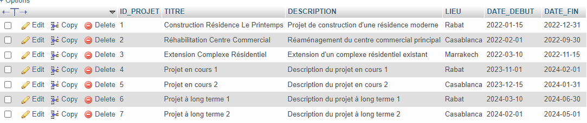
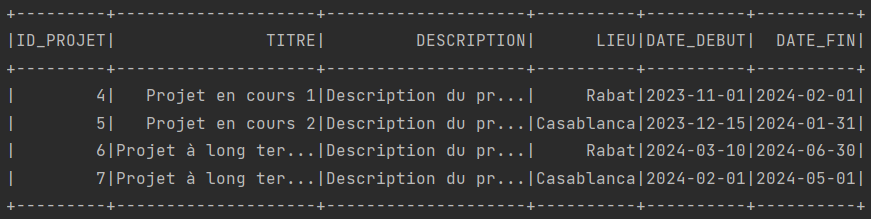
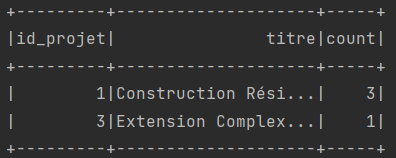
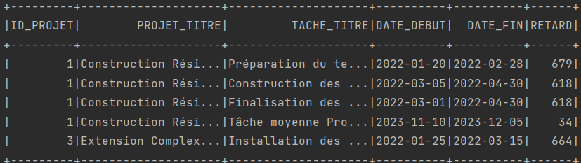
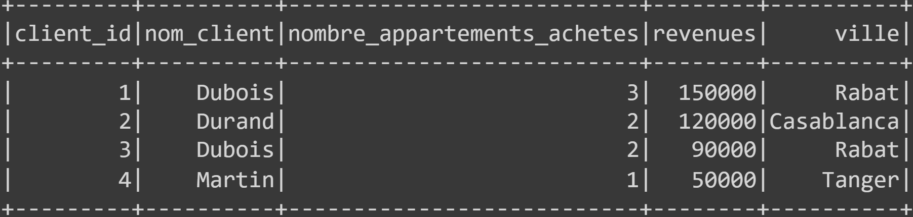
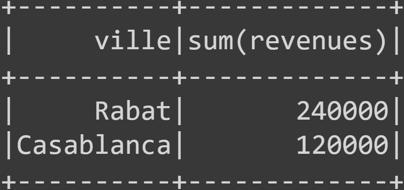

#
## Partie 1 - Traitement de données stockées dans MySQL
### Les tables MySQL
#### La table TACHES

#### La table PROJETS

### Question 1 : Afficher les projets en cours de réalisation
#### Code Snippet 💻
```java
public class App {
    public static void main(String[] args) {
        // Connection SparkSession
        SparkSession spark = SparkSession.builder()
                .appName("Application")
                .master("local[*]")
                .getOrCreate();

        // Lecture de données utilisant JDBC
        Dataset<Row> dataframe = spark
                .read()
                .format("jdbc")
                .option("driver", "com.mysql.jdbc.Driver")
                .option("url", "jdbc:mysql://localhost:3306/db_imomaroc")
                .option("dbtable", "projets")
                .option("user", "root")
                .option("password", "")
                .load();

        // Affichage des projets encore de realisation
        dataframe.filter("date_fin > now()").show();
    }
}
```

#### Résultat ✅



### Question 2 : Afficher pour chaque projet, le nombre de tâches dont la durée dépasse un mois
#### Code Snippet 💻
```java
public class App {
    public static void main(String[] args) {
        // Connection SparkSession
        SparkSession spark = SparkSession.builder()
                .appName("Application")
                .master("local[*]")
                .getOrCreate();

        // Lecture de données utilisant JDBC (PROJETS)
        Dataset<Row> projets = spark
                .read()
                .format("jdbc")
                .option("driver", "com.mysql.jdbc.Driver")
                .option("url", "jdbc:mysql://localhost:3306/db_imomaroc")
                .option("query", "select id_projet, titre from projets")
                .option("user", "root")
                .option("password", "")
                .load();

        // Lecture de données utilisant JDBC (TACHES)
        Dataset<Row> taches = spark
                .read()
                .format("jdbc")
                .option("driver", "com.mysql.jdbc.Driver")
                .option("url", "jdbc:mysql://localhost:3306/db_imomaroc")
                .option("query", "select id_projet, date_debut, date_fin from taches")
                .option("user", "root")
                .option("password", "")
                .load();

        // Une pour chaque projet, le nombre de taches dont la durée dépasse un mois
        // Le format de sortie est le suivant:
        // ID_PROJET | TITRE | NOMBRE
        projets.join(taches, "id_projet")
                .filter("datediff(date_fin, date_debut) > 30")
                .groupBy("id_projet", "titre")
                .count()
                .show();
        // Fermeture de la session Spark
        spark.close();
    }
}
```

#### Résultat ✅


### Question 3 : Afficher pour chaque projet les tâches en retard

#### Code Snippet 💻
```java
public class App {
    public static void main(String[] args) {
        // Connection SparkSession
        SparkSession spark = SparkSession.builder()
                .appName("Application")
                .master("local[*]")
                .getOrCreate();

        // Lecture de données utilisant JDBC (PROJETS)
        Dataset<Row> projets = spark
                .read()
                .format("jdbc")
                .option("driver", "com.mysql.jdbc.Driver")
                .option("url", "jdbc:mysql://localhost:3306/db_imomaroc")
                .option("query", "select * from projets")
                .option("user", "root")
                .option("password", "")
                .load();

        // Lecture de données utilisant JDBC (TACHES)
        Dataset<Row> taches = spark
                .read()
                .format("jdbc")
                .option("driver", "com.mysql.jdbc.Driver")
                .option("url", "jdbc:mysql://localhost:3306/db_imomaroc")
                .option("query", "select * from taches")
                .option("user", "root")
                .option("password", "")
                .load();

        Dataset<Row> joined = projets.join(taches, projets.col("ID_PROJET").equalTo(taches.col("ID_PROJET")));

        // Filter the tasks that are not finished and are delayed
        Dataset<Row> delayedTasks = joined.filter(taches.col("TERMINE").equalTo(0)
                .and(taches.col("DATE_FIN").lt(current_date())));

        // Select the necessary fields
        Dataset<Row> result = delayedTasks.select(projets.col("ID_PROJET"), projets.col("TITRE").as("PROJET_TITRE"),
                taches.col("TITRE").as("TACHE_TITRE"), taches.col("DATE_DEBUT"), taches.col("DATE_FIN"),
                datediff(current_date(), taches.col("DATE_FIN")).as("RETARD"));

        // Display the result
        result.show();

        // Close the Spark session
        spark.close();
    }
}
```

#### Résultat ✅


## Partie 2 - Traitement de données stockées dans un fichier Json (Avec PySpark ✨)

### Example des données
```python
from pyspark.sql import SparkSession

spark = SparkSession.builder.getOrCreate()
df = spark.read.option("multiline", True).json('ventes.json')
df.show()
```


### 1. Afficher les deux premières villes où l’entreprise a réalisé le plus de ventes (en termes de revenus)

#### Code Snippet 💻(PySpark)
```python
from pyspark.sql import SparkSession

spark = SparkSession.builder.getOrCreate()
df = spark.read.option("multiline", True).json('ventes.json')

df.groupBy('ville').agg({'revenues': 'sum'}).orderBy('sum(revenues)', ascending=False).limit(2).show()

```

#### Résultat ✅


### 2. Afficher la liste des clients qui possèdent plus qu’un appartement à rabat.
#### Code Snippet 💻(PySpark)
```python
from pyspark.sql import SparkSession

spark = SparkSession.builder.getOrCreate()
df = spark.read.option("multiline", True).json('ventes.json')

df.filter(df.ville == 'Rabat').groupBy('nom_client').count().filter('count > 1').show()
```

#### Résultat ✅


### 3. Afficher le nombre d’appartements vendues à Casablanca.
#### Code Snippet 💻(PySpark)
```python
from pyspark.sql import SparkSession

spark = SparkSession.builder.getOrCreate()
df = spark.read.option("multiline", True).json('ventes.json')

df.filter(df.ville == 'Casablanca').groupBy('nom_client').count().show()
```

#### Résultat ✅
